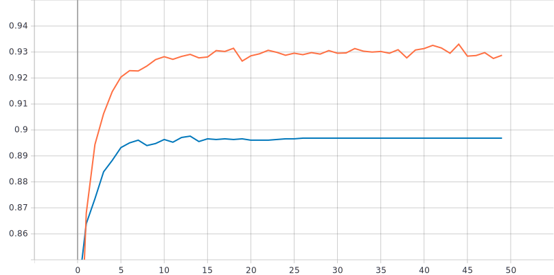
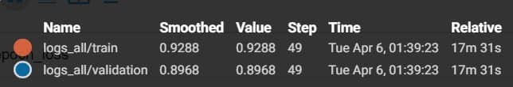
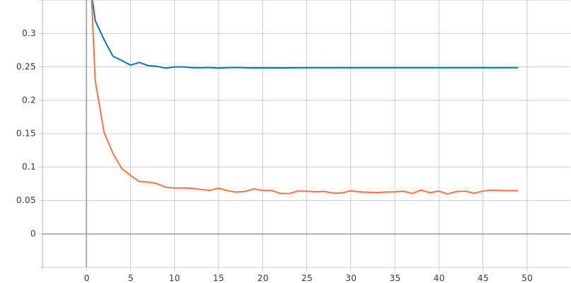
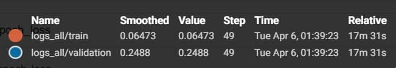

Лабораторная работа 4.  
====

# Немного информации о цели лабараторной работы
Исследование влияния техники Fine Tuning на процесс обучения нейронной сети на примере решения задачи классификации Oregon Wildlife. В данной работе использовалась нейронная сеть EfficientNet-B0, предобученная  на базе изображений ImageNet с использованием политики изменения темпа обучения - Экспоненциальное затухание (Exponential Decay) с параметрами initial_lrate = 0.01 и k = 0.25. Также будут использоваться техники аугментации данных с оптимальными парамтерами, полученными в прошлой работе.

* В качестве оптимальных использовались следующии параметры:
```
  Манипуляции с яркостью и контрастом: contrast_factor = 2, delta = 0.25
  Поворот изображения на случайный угол: factor = 0.025
  Использование случайной части изображения: height = 275, width = 275
  Добавление случайного шума: stddev = 0.1
```

# С использованием техники обучения Transfer Learning, оптимальной политики изменения темпа обучения, аугментации данных с оптимальными настройками обучить нейронную сеть EfficientNet-B0 (предварительно обученную на базе изображений imagenet) для решения задачи классификации изображений Oregon WildLife.

* Функции изменения контраста, где image - входное изображение, 0.5  - множитель для регулировки контраста (contrast_factor).
```
def contrast(image, label):  
  return tf.image.adjust_contrast(image, 0.5), label
```

* Функции изменения яркости, где image - входное изображение, delta = 0.1  - число добавляемое к значениям пикселей.
```
def brightness(image, label):
  return tf.image.adjust_brightness(image, delta=0.1),label
```

* Вызов функции производился в TFRecordDataset:
```
return tf.data.TFRecordDataset(filenames)\
    .....
    .map(contrast)\
    .map(brightness)\
    ....

```

* Для поворота изображения на случайный угол  в архитектуру нейронной сети был добавлен следующий слой с параметром factor=(0, 0.25) - определяет диапазон из которого будет случайно выбран угол поворота. 
```
 x = tf.keras.layers.experimental.preprocessing.RandomRotation(factor=(0, 0.25))(inputs)
```

* Для поворота изображения на случайный угол  в архитектуру нейронной сети был добавлен следующий слой с параметрами 0.01(stddev) - значение среднеквадратичного отклонения добавляемого шума.
```
 x = tf.keras.layers.GaussianNoise(0.01)(inputs)
```

* Для использования случайной части изображения в архитектуру нейронной сети был добавлен следующий слой:
```
  x = tf.keras.layers.experimental.preprocessing.RandomCrop(224,224)(x) 
```
* И изменнен слой
```
example['image'] = tf.image.resize(example['image'], tf.constant([235, 235])) #входное изображение 235х235
```

 ### Графики обучения для предобученной нейронной сети EfficientNet-B0 с совместным использованием техник аугментации данных с оптимальными параметрами:
  
 ***График метрики точности:*** 


***Пояснение:*** 
 


 ***График функции потерь:*** 
 


 ***Пояснение:*** 
 



### Анализ результатов:
* Смотря на графки на валидационном наборе данных можно сказать: 
   - из графика точности видно, что в конце обучения достигается точность равная 89,68%
   - из графки потерь видно, что в конце обучения потери стотавляют 0.2488 
